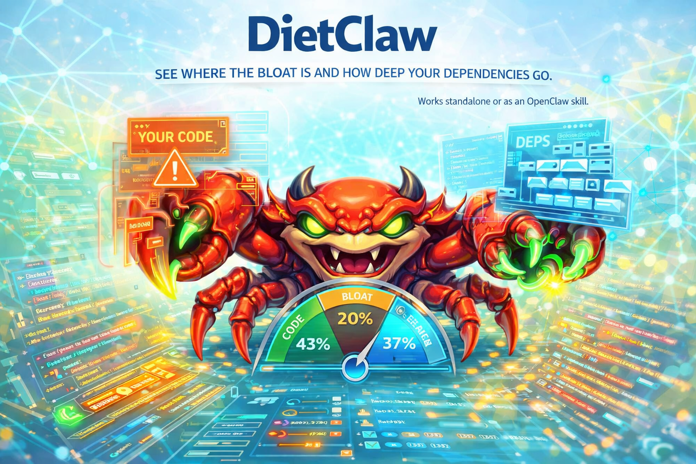

# Dietclaw

[](https://www.npmjs.com/package/dietclaw)

Codebase health monitor. See where the bloat is, how deep your dependencies go, and what's actually your code vs what you're carrying. Works standalone or as an OpenClaw skill.

<p align="center">
  
</p>

## What It Does

- separates your code from everything else (dependencies, assets, generated files, configuration)
- shows the source-to-bloat ratio
- counts transitive dependencies and shows how many packages get installed
- detects large files, long files, and duplicate files
- analyzes outdated packages, unused dependencies, and heaviest packages
- compares multiple projects side by side with `--each`
- `--json` flag on all commands for agents and scripts

## Requirements

- Node 22+
- pnpm

## Install

```bash
git clone https://github.com/psandis/dietclaw.git
cd dietclaw
pnpm install
pnpm build
```

## Quick Start

```bash
pnpm cli scan                      # scan current directory
pnpm cli scan ../myproject         # scan another project
pnpm cli scan ~/Projects --each    # compare all projects
pnpm cli deps                      # dependency analysis
```

## CLI

All commands are run with `pnpm cli <command>`.

### Scan a project

```
dietclaw scan

  Project Health Report
  /home/dev/myapp

  Weight
    Total        2.1 MB
    Source code  42.8 KB  (2.0%)

  Breakdown

┌─────────────────┬────────┬───────┬───────┐
│ Category        │ Size   │ Files │ Share │
├─────────────────┼────────┼───────┼───────┤
│ Assets          │ 1.9 MB │ 3     │ 92.4% │
│ Source code     │ 42.8 KB│ 18    │ 2.0%  │
│ Generated files │ 64.2 KB│ 2     │ 3.0%  │
│ Configuration   │ 5.6 KB │ 7     │ 0.3%  │
└─────────────────┴────────┴───────┴───────┘

  Dependencies
    Direct       8 production + 9 development
    Installed    214 packages (148.3 MB)

  Languages

┌────────────┬───────┬───────┬───────┐
│ Language   │ Lines │ Files │ Share │
├────────────┼───────┼───────┼───────┤
│ TypeScript │ 1,840 │ 16    │ 68.2% │
│ JSON       │ 482   │ 5     │ 17.9% │
│ Markdown   │ 312   │ 3     │ 11.6% │
│ CSS        │ 64    │ 2     │ 2.4%  │
└────────────┴───────┴───────┴───────┘

  Large Files (2)
  Files exceeding the size threshold

┌──────────────────┬────────┐
│ File             │ Size   │
├──────────────────┼────────┤
│ public/hero.png  │ 1.4 MB │
│ public/logo.png  │ 512 KB │
└──────────────────┴────────┘
```

Notes:

- `--limit <n>` controls how many large/long files to show (default: `10`)
- `--json` outputs structured JSON for scripts and agents

### Compare multiple projects

```
dietclaw scan ~/Projects --each

  Project Comparison

┌─────────────┬─────────────┬──────────┬──────────────┐
│ Project     │ Source code │ Assets   │ Dependencies │
├─────────────┼─────────────┼──────────┼──────────────┤
│ api-server  │ 12.4 KB     │ —        │ 187.2 MB     │
│ dashboard   │ 28.1 KB     │ 4.2 MB   │ 294.7 MB     │
│ mobile-app  │ 45.3 KB     │ 892.0 KB │ 203.5 MB     │
│ shared-lib  │ 8.7 KB      │ —        │ 31.4 MB      │
└─────────────┴─────────────┴──────────┴──────────────┘
```

Notes:

- detects subprojects by looking for project markers (`package.json`, `Cargo.toml`, `go.mod`, etc.)
- project markers are configurable in `data/defaults.jsonc`

### Dependency analysis

```
dietclaw deps

  Dependency Analysis

  Outdated Packages (3)

┌─────────────┬─────────┬────────┬────────┐
│ Package     │ Current │ Latest │ Update │
├─────────────┼─────────┼────────┼────────┤
│ next        │ 14.1.0  │ 16.2.1 │ major  │
│ react       │ 18.3.1  │ 19.2.4 │ major  │
│ autoprefixer│ 10.4.21 │ 10.4.27│ patch  │
└─────────────┴─────────┴────────┴────────┘

  Heaviest Packages (top 20)

┌──────────────────────────┬──────────┐
│ Package                  │ Size     │
├──────────────────────────┼──────────┤
│ @next/swc-darwin-arm64   │ 129.4 MB │
│ typescript               │ 21.8 MB  │
│ prisma                   │ 70.6 MB  │
└──────────────────────────┴──────────┘

  Version Conflicts (5)
  These packages exist multiple times in your project at different versions.

┌───────────┬───────────────────┬───────────┐
│ Package   │ Installed version │ Needed by │
├───────────┼───────────────────┼───────────┤
│ commander │ 14.0.3            │ direct    │
│ commander │ 4.1.1             │ sucrase   │
└───────────┴───────────────────┴───────────┘
```

Notes:

- `--limit <n>` controls how many items per section (default: `20`)
- `--json` outputs structured JSON for scripts and agents

## Configuration

All classification rules live in `data/defaults.jsonc` — a JSONC file with inline comments explaining every option. No code changes needed to:

- add new languages or file extensions
- change what counts as source code, assets, data, or binaries
- adjust thresholds for large files (default: 500 KB) and long files (default: 300 lines)
- add directories to the ignore list
- add project markers for `--each` detection

## Agent Integration

All commands support `--json` for structured output:

```bash
dietclaw --json scan
dietclaw --json deps
dietclaw --json scan ~/Projects --each
```

### OpenClaw Skill

Once installed globally (`npm install -g dietclaw`), add a `SKILL.md` to your workspace:

```markdown
---
name: dietclaw
description: Codebase health monitor — find bloat, complexity, and dependency weight
version: 1.0.0
requires_binaries:
  - dietclaw
---

When the user asks about project health, size, bloat, or dependencies, use the `dietclaw` CLI:

- To scan a project: `dietclaw --json scan`
- To analyze dependencies: `dietclaw --json deps`
- To compare projects: `dietclaw --json scan ~/Projects --each`
```

## Roadmap

- `dietclaw trend` — historical tracking with snapshots over time
- `dietclaw monitor` — runtime performance monitoring (memory, CPU)
- CI-friendly exit codes and thresholds

## Development

```bash
git clone https://github.com/psandis/dietclaw.git
cd dietclaw
pnpm install
pnpm build
pnpm test
pnpm lint
pnpm cli --help
```

## Related

- 🦀 [Dustclaw](https://github.com/psandis/dustclaw) — Find out what is eating your disk space
- 🦀 [Driftclaw](https://github.com/psandis/driftclaw) — Deployment drift detection across environments
- 🦀 [Feedclaw](https://github.com/psandis/feedclaw) — RSS/Atom feed reader and AI digest builder
- 🦀 [OpenClaw](https://github.com/openclaw/openclaw) — The open claw ecosystem

## License

See [MIT](LICENSE)
